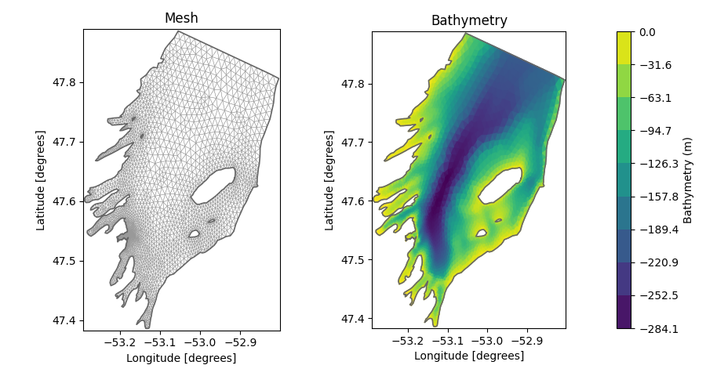
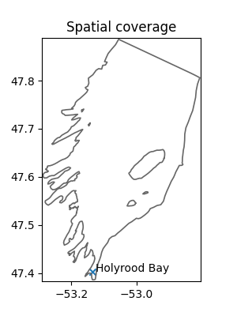
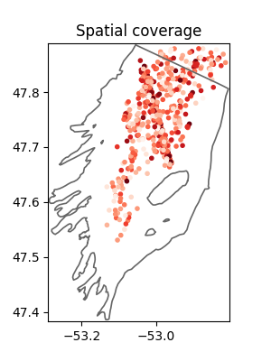
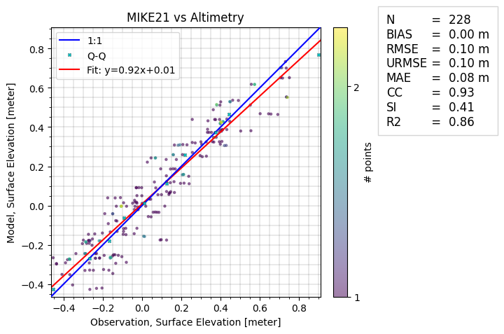

# Hydrodynamic model of Conception Bay
This README file contains practical information and background information on the data. The dataset can be cited as:

> DHI. (2024). Hydrodynamic model of Conception Bay: MIKE21 model setup, outputs and observation data (1.0) [Data set]. Zenodo. [https://doi.org/10.5281/zenodo.14504931](https://doi.org/10.5281/zenodo.14504931)

See the [license](license.txt) for information on using the data.

#### Disclaimer:
*The included MIKE21 model setup is designed as a simple demonstration for educational and research purposes. It is not optimized for precision or exhaustive calibration and should not be regarded as a benchmark for best practices in hydrodynamic modeling. The results should not be used for operational or decision-making purposes.*

## Intended use

The dataset is aimed at supporting educational, research, and exploratory activities, such as:

* Experimenting with coastal and ocean modeling using MIKE 21.
* Validating hydrodynamic model outputs with observational data.
* Developing methods for automatically calibrating model parameters.
* Building data-driven models, including machine learning surrogates of the MIKE simulation results.

## Folder structure

The repository is organized in the following way

- README.md
- license
- model
    + MIKE model setup file (.m21fm)
    + log file (.log)
- input
    + meteorological forcing (wind, air pressure)
    + lateral boundary conditions (water level and currents)
    + mesh file (.mesh)
- observations
    + csv files containing observational data for model validation
- code
    + Jupyter notebooks exploring the dataset
    + Jupyter notebooks for model validation using observations
    + a requirements file (.txt)
- figures
    + figures generated by notebooks
- output_sample
    + a reduced MIKE model result data file (.dfsu and .dfs0)

Separately from the current repository, you can find the output zip file (in Zenodo):

- output
    + MIKE model result data (.dfsu and .dfs0)

## Introduction

This folder contains data for a simulation with the MIKE 21 Flow Model FM in Conception Bay located in Newfoundland, Canada. The water level in this area is heavily influenced by semidiurnal tides from the Atlantic Ocean, and wind-driven circulation plays an important role in the area.  The domain has one open boundary to the ocean to the North.

This repository contains the setup file, input data and observation data, as well as simulation result data. The simulation result data is available in Zenodo. The data supplied in this repository covers the period from 2014-01-01 to 2022-12-31. There is a spin-up period, so it is recommended to remove the first 2 days of the result data. 

## The MIKE 21 Flow Model FM

MIKE 21 Flow Model FM is a modelling system based on a flexible mesh approach. The modelling system has been developed for applications within oceanographic, coastal and estuarine environments. The model is based on the numerical solution of the two-dimensional shallow water equations - the depth-integrated incompressible Reynolds averaged Navier-Stokes equations. More information can be found [in the documentation](https://manuals.mikepoweredbydhi.help/latest/Coast_and_Sea/MIKE_FM_HD_2D.pdf).

The Conception Bay mesh consists of triangular elements in a higher resolution close to the coast than on deeper waters, and for each node a depth value is assigned by interpolating the EMODnet bathymetry data. The mesh is shown in the figure below. It consists of a total of 8474 elements covering the area of approximately 900 $km^2$.

A simulation can be performed with the [MIKE modelling software](https://www.dhigroup.com/technologies/mikepoweredbydhi), while supplying the following data for driving the model:

- the water levels and current velocities on the North boundary
- wind velocities and air pressure in the domain.

This input data can be found in the [/input](/input) folder. Model parameters, e.g. bed resistance constant, can be calibrated by comparing the model simulations to observational data. 

The outputs of the model are given as a timeseries for each mesh element on the spatial domain containing the variables:
- the surface elevation,
- the u and v components of the current velocity.

This data can be found as a separate file in [Zenodo](https://doi.org/10.5281/zenodo.14504931). Once a simulation has been run, a log file will be generated. The log-file for the benchmark simulation is found in the folder [/model](/model), and it contains information on the parameters used and the time spent on the simulation. 

Since all data, including output from a simulation, is given, it is not necessary to run the MIKE simulation. However, it is possible, since a setup file is supplied as well as all of the input data. Running the MIKE software requires a license. Read more about [obtaining a license](https://www.dhigroup.com/technologies/mikepoweredbydhi/pricing) and about [academic licensing](https://www.dhigroup.com/technologies/mikepoweredbydhi/pricing/academic-licenses). If you already have a license, read the [step-by-step guide](https://manuals.mikepoweredbydhi.help/latest/Coast_and_Sea/MIKE_FM_HD_Step_By_Step.pdf) to learn how to run simulations.

The input and output data are given as dfs files. These files can be processed using the MIKE IO Python package developed by DHI. Find more information on the data types in the [MIKE IO documentation](https://dhi.github.io/mikeio/).

## Model validation

The [ModelSkill Python package](https://dhi.github.io/modelskill/) developed at DHI can be used for validating the model outputs by comparing to observational data. 

The model is validated by comparison to observational data from a measurement station in Conception Bay and altimetry data from satellites. This is done in the notebooks code/model_validation_*.ipynb. The leftmost figure below shows the location of the measurement stations, and the rightmost figure shows the coverage of the altimetry data.

Below, the comparison between the observational data from one such measurement station and MIKE 21 is shown first followed by the comparison to the altimetry data. The production of these and many more plots is found in the notebooks code/model_validation_*.ipynb.

## Data sources

Several data sources contribute to this case. They are outlined below. 

The following changes have been made to the data:

- Sea levels in measurement stations: Data has been filtered to only include "good" or "probably good" data points according to quality flags. The coordinates of some stations have been moved into the simulation domain, since they are sometimes located so close to land (e.g. in a harbor) that the mesh is not covering it. 
- Current velocities in measurement stations: Data has been filtered to only include "good" or "probably good" data points according to quality flags. Some faulty observations have been removed manually (e.g. zero-values and outliers). The u and v components of the current velocities are calculated from the speed and directions. The data is given at different depths, so depth-averaged values have been calculated. 
- Altimetry data: Data has been filtered to only include "good" data points according to quality flags. 

| Data   | Source|  Citation | License | 
| -------- | ------- | ------- | ------- |
| Mesh | The mesh is developed by DHI. | Repository citation, see [the top](#Conception-Bay-as-a-benchmark-case) | [CC BY 4.0](https://creativecommons.org/licenses/by/4.0/) |
| Bathymetry | Canadian Hydrographic Service | Fisheries and Oceans Canada, "Canadian Hydrographic Service Non-Navigational (NONNA) Bathymetric Data" (2024) | [Open Government Licence - Canada](https://open.canada.ca/en/open-government-licence-canada), and the CHS NONNA Licence found in [license.txt](license.txt). |
| Wind and Air pressure | The ERA5 reanalysis of globate climate. Produced by Copernicus Climate Change Service at ECMWF. | Hersbach, H., Bell, B., Berrisford, P., Biavati, G., Horányi, A., Muñoz Sabater, J., Nicolas, J., Peubey, C., Radu, R., Rozum, I., Schepers, D., Simmons, A., Soci, C., Dee, D., Thépaut, J-N. (2023): ERA5 hourly data on pressure levels from 1940 to present. Copernicus Climate Change Service (C3S) Climate Data Store (CDS), DOI: 10.24381/cds.bd0915c6 (Accessed on 19-12-2023) | See full license [here](https://apps.ecmwf.int/datasets/licences/copernicus/). Excerpt: "Access to Copernicus Products is given for any purpose in so far as it is lawful, whereas use may include, but is not limited to: reproduction; distribution; communication to the public; adaptation, modification and combination with other data and information; or any combination of the foregoing." |
| Boundary condition | The surface elevation values for the boundary conditions are derived from the DHI regional North Atlantic HD storm surge model and combined with 42-years of tidal boundary conditions using the Bedford Institute of Oceanography (BIO) Government of Canada WebTide model, to create a total water level signal that includes both surge and tidal components. More information is found [here](https://www.bio.gc.ca/science/research-recherche/ocean/webtide/index-en.php). | The BIO model: Dupont, F., C.G. Hannah, D.A. Greenberg, J.Y. Cherniawsky and C.E. Naimie. 2002. Modelling System for Tides. Can. Tech. Rep. Hydrogr. Ocean Sci. 221: vii + 72pp. [https://www.bio.gc.ca/science/research-recherche/ocean/webtide/documents/WebTide_report4.pdf](https://www.bio.gc.ca/science/research-recherche/ocean/webtide/documents/WebTide_report4.pdf). | BIO model disclaimer: "This program is distributed by the copyright holder and contributors in the hope that it will be useful. It is provided "AS IS" without warranties of any kind, whether express or implied. This includes, but is not limited to, merchantability or fitness for a particular purpose. In no event shall the copyright holder be liable for damages, including any general, special, incidental or consequential damages arising out of the use or inability to use the program (including, but not limited to, loss of use, data or profits). This program is not to be used for navigation purposes." |
| Sea levels in measurement stations | The data is from the Fisheries and Oceans Canada (DFO) historical water level gauge. No changes were made to the data. The data for the exact station can be found [here](https://www.isdm-gdsi.gc.ca/isdm-gdsi/twl-mne/inventory-inventaire/sd-ds-eng.asp?no=925&user=isdm-gdsi&region=MEDS). | DFO (2024). Marine Environmental Data Section Archive, [https://meds-sdmm.dfo-mpo.gc.ca](https://meds-sdmm.dfo-mpo.gc.ca), Ecosystem and Oceans Science, Department of Fisheries and Oceans Canada. Data obtained on 2024/10/01. | Policy is found in [data/observations/Observation_data_policy.doc](data/observations/Observation_data_policy.doc). |

### Altimetry data

The altimetry data is extracted from a range of different sources. The data is based on satellite observations, and the data is downloaded using [DHI's services for marine observation data](https://altimetry.dhigroup.com/). Data sources:

| Satellite name    | Owner|  Link |
| -------- | ------- | ------- |
| CryoSat-2 (c2) | European Space Agency (ESA) |  [https://earth.esa.int/eogateway/catalog/cryosat-products](https://earth.esa.int/eogateway/catalog/cryosat-products)  |
| SARAL (sa) | French National Space Agency (CNES) and Indian Space Research Organisation (ISRO) | [https://podaac.jpl.nasa.gov/dataset/ALTIKA_SARAL_L2_OST_XOGDR](https://podaac.jpl.nasa.gov/dataset/ALTIKA_SARAL_L2_OST_XOGDR) |
| Jason-2 (j2) | National Aeronautics and Space Administration (NASA) and French National Space Agency (CNES) | [https://podaac.jpl.nasa.gov/OSTM-JASON2](https://podaac.jpl.nasa.gov/OSTM-JASON2) |
| Sentinel-3B (3b) | European Space Agency (ESA) | [https://sentiwiki.copernicus.eu/web/s3-altimetry-instruments](https://sentiwiki.copernicus.eu/web/s3-altimetry-instruments) |